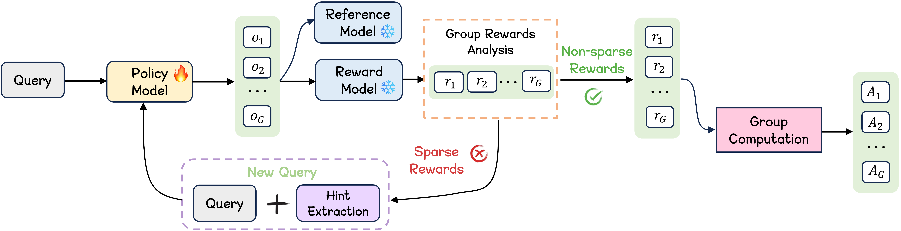
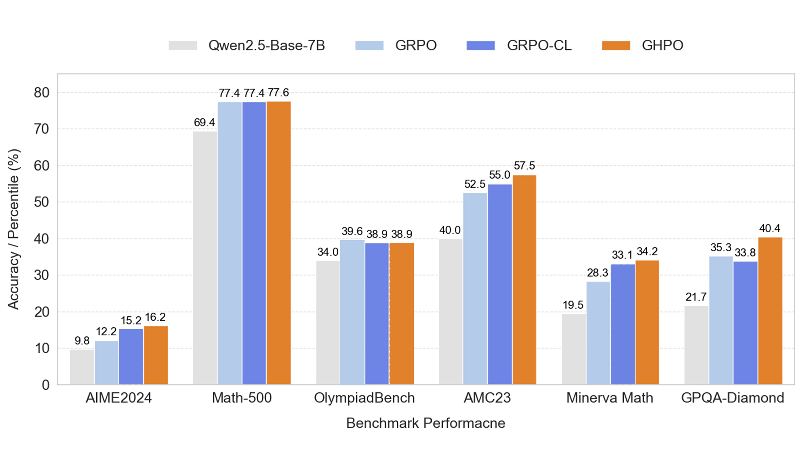

<div align="center">


<h1 style="display: flex; justify-content: center; align-items: center; gap: 10px; margin: 0;">
  GHPO: Adaptive Guidance for Stable and Efficient LLM Reinforcement Learning
</h1>
<p align="center"><em>A difficulty-aware reinforcement learning framework in large reasoning models.</em></p>

<div align="center">
  
</div>

[](http://arxiv.org) [](https://huggingface.co/datasets/hkgc/math3to5_olympiads_aime)

</div>

# 🎉News
- **[2025/07/07]** GHPO code is released.
- **[2025/07/07]** GHPO paper available on [arXiv](http://arxiv.org/).


---


## 📖 Introduction

**G**uided **H**ybrid **P**olicy **O**ptimization (**GHPO**) introduces a novel difficulty-aware reinforcement learning framework designed to address the issue of capacity-difficulty mismatch. This occurs when the complexity of the training data outpaces the model’s current capabilities, resulting in critically sparse reward signals and stalled learning progress. This challenge is particularly acute for smaller, more resource-efficient LLMs. GHPO dynamically calibrates task difficulty by employing adaptive prompt refinement to provide targeted guidance. This unique approach adaptively balances direct imitation learning for problems currently beyond the model's reach with exploration-based reinforcement learning for more manageable tasks, effectively creating a smooth and optimized learning curriculum.

<div align="center">
  
</div>

### ✨ Key Highlights:
- Identifies the critical role of capacity alignment in RLVR and propose the GHPO framework to improve training stability and efficiency.
- Introduces an automated framework to detect sample difficulty and adaptively switch between on-policy reinforcement learning and guided imitation learning by adaptive prompt refinement.
- Extensive experiments demonstrate that GHPO outperforms state-of-the-art RL methods. Results show consistent performance gains across different model families, validating the effectiveness and robustness of our approach.
---

## 🔧 Installation

> [!NOTE]
> GHPO is built on top of the [Open R1](https://github.com/huggingface/open-r1). You can refer to this repository for additional guidance and support.

You may create a Python virtual environment using [uv](https://github.com/astral-sh/uv):

```bash
uv venv ghpo_env --python 3.11 && . ghpo_env/bin/activate && uv pip install --upgrade pip
uv pip install vllm==0.8.4
uv pip install setuptools
uv pip install flash-attn==2.7.4.post1 --no-build-isolation
GIT_LFS_SKIP_SMUDGE=1 uv pip install -e ".[dev]"
```

> [!CAUTION]
> Libraries rely on CUDA 12.4.

Next, log into your Hugging Face and Weights and Biases accounts as follows:

```shell
huggingface-cli login
wandb login
```

---

## :bulb: Usage
This repository includes the GHPO implementation under the `src/ghpo` directory.

The original [Open R1](https://github.com/huggingface/open-r1) supports training models with either DDP or DeepSpeed (ZeRO-2 and ZeRO-3), and use TRL's [vLLM backend](https://huggingface.co/docs/trl/speeding_up_training?vllm+examples=GRPO#vllm-for-fast-generation-in-online-methods) to scale training to large models across multiple nodes.

For multi-node training on N nodes, with 1 node running the vLLM server and N-1 nodes running training, first spin up the vLLM server to run on e.g. 1 GPU as follows:
```shell
CUDA_VISIBLE_DEVICES=0 trl vllm-serve --model Qwen/Qwen2.5-Math-7B
```

Once the server is up, run training on the remaining GPUs as follows:

```shell
CUDA_VISIBLE_DEVICES=1,2,3,4,5,6,7 ACCELERATE_LOG_LEVEL=info \
    accelerate launch --config_file recipes/accelerate_configs/zero3.yaml \
    --num_processes=7 src/ghpo/ghpo.py \
    --config recipes/Qwen2.5-Math-7B/ghpo/config_ghpo.yaml
```

You can configure the parameters in each YAML configuration file (e.g., config_ghpo.yaml). For example:
```shell
# Model arguments
model_name_or_path: Qwen/Qwen2.5-Math-7B
model_revision: main
torch_dtype: bfloat16
attn_implementation: flash_attention_2

# Data training arguments
dataset_name: hkgc/math3to5_olympiads_aime
dataset_prompt_column: problem
system_prompt: "You are a helpful AI Assistant that provides well-reasoned and detailed responses. You first think about the reasoning process as an internal monologue and then provide the user with the answer. Respond in the following format: <think>\n...\n</think>\n<answer>\n...\n</answer>"

# GHPO trainer config
beta: 0.0
bf16: true
use_vllm: true
vllm_device: auto
vllm_gpu_memory_utilization: 0.75
do_eval: true
eval_strategy: "no"
eval_steps: 1
gradient_accumulation_steps: 28
gradient_checkpointing: true
gradient_checkpointing_kwargs:
  use_reentrant: false
hub_model_id: Qwen2.5-Math-7B-ghpo
hub_strategy: every_save
learning_rate: 1.0e-06
log_completions: true
log_level: info
logging_first_step: true
logging_steps: 5
logging_strategy: steps
lr_scheduler_type: cosine
max_prompt_length: 2048
max_completion_length: 2048
max_steps: -1
num_generations: 8
num_train_epochs: 5
output_dir: Qwen2.5-Math-7B-ghpo
overwrite_output_dir: true
per_device_eval_batch_size: 8
per_device_train_batch_size: 8
push_to_hub: true
report_to:
- wandb
reward_funcs:
- accuracy
- format
reward_weights:
- 1.0
- 0.5
scale_rewards: true
rl_type: "ghpo"
hint_ratio: 0.5
start_hint_step: 0
save_strategy: "epoch"
seed: 42
warmup_ratio: 0.1
save_total_limit: 6
temperature: 1.0
```

You can switch the reinforcement learning mode by setting the `rl_type` configuration parameter to either `ghpo` or `grpo`.

---
## 📃Evaluation
We use [lighteval](https://huggingface.co/docs/lighteval/index) to evaluate models. For example, use _data parallel_ as follows:
```shell
CUDA_VISIBLE_DEVICES=0,1,2,3,4,5,6,7
NUM_GPUS=8
MODEL={model_name}
MODEL_ARGS="pretrained=$MODEL,dtype=bfloat16,data_parallel_size=$NUM_GPUS,max_model_length=8192,max_num_batched_tokens=8192,gpu_memory_utilization=0.8,generation_parameters={max_new_tokens:8192,temperature:0.01,top_p:0.95}"
TASK=aime24
OUTPUT_DIR=data/evals/$MODEL

lighteval vllm $MODEL_ARGS "lighteval|$TASK|0|0" \
    --system-prompt=$'You are a helpful AI Assistant that provides well-reasoned and detailed responses. You first think about the reasoning process as an internal monologue and then provide the user with the answer. Respond in the following format: <think>\n...\n</think>\n<answer>\n...\n</answer>' \
    --use-chat-template \
    --output-dir $OUTPUT_DIR
```
---
## 📬 Contact

For questions, feedback, or collaboration opportunities, feel free to reach out:
- Ziru Liu: LiuZiru6@huawei.com
- Rui Liu: liu.rui2@huawei.com

## Citation
If you find our model, data, or evaluation code useful, please kindly cite our paper:
```bib
@misc{ghpo,
      title={GHPO: Adaptive Guidance for Stable and Efficient LLM Reinforcement Learning}, 
      author={Ziru Liu, Cheng Gong, Xinyu Fu, Yaofang Liu, Ran Chen, Shoubo Hu, Suiyun Zhang, Rui Liu, Qingfu Zhang, Dandan Tu},
      year={2025},
      eprint={1},
      archivePrefix={arXiv},
      url={https://arxiv.org/}, 
}
```


